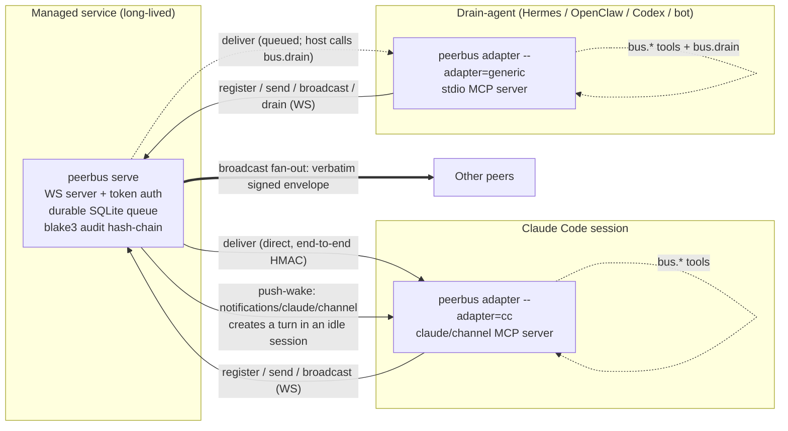

# :satellite: peerbus — Agent-Agnostic Durable Message Bus

[](https://github.com/nnemirovsky/peerbus/actions/workflows/test.yml)
[](https://github.com/nnemirovsky/peerbus/actions/workflows/lint.yml)
[](LICENSE)
[](https://goreportcard.com/report/github.com/nnemirovsky/peerbus)
[](https://github.com/nnemirovsky/peerbus/releases/latest)

One long-lived broker plus thin adapters that let heterogeneous AI agents — Claude Code, Hermes, OpenClaw, Codex CLI, a bespoke bot — send and broadcast durable, end-to-end-signed messages to each other across machines.

## Why peerbus

AI agents increasingly run side by side and need to talk to each other. The existing tool for this is single-machine, filesystem-bound, and Claude-only.

**The problem:** [`non4me/cc2cc`](https://github.com/non4me/cc2cc) pioneered Claude-Code-to-Claude-Code messaging, but it conflates the bus with the session. It is single-machine (filesystem transport), Claude-Code-only, and — worst — it spawns a per-session `server.mjs` that orphans when the session ends and burns CPU in the background indefinitely. There is no durable cross-machine bus that any agent runtime can join.

**The solution:** peerbus splits the bus into two parts. One **long-lived, managed broker** holds a durable, at-least-once SQLite queue and a tamper-evident audit log; it outlives every session and is 100% agent-agnostic. Any number of **thin, ephemeral adapter** processes connect to it on behalf of an agent runtime. An adapter dies with the session that owns it; the broker never does. That split designs the cc2cc orphan bug out by construction.

Messages are peer-to-peer and out-of-band: peerbus moves messages *between already-running interactive agents*. It never drives one agent from another. The "only escalate to a human when a real decision is needed" policy lives entirely in the *consuming agent's* prompt (keyed off the message's `source` tag) — never in peerbus. peerbus is a role-neutral transport.

**Honest taxonomy:** this is a **custom MCP-channel peer bus**. It is *conceptually* A2A-shaped — peer agents, asynchronous messages, human escalation handled by the peer rather than the bus — but it is **not** an implementation of Zed's [Agent Client Protocol](https://github.com/zed-industries/agent-client-protocol) nor of the Google / Linux Foundation [Agent2Agent (A2A)](https://github.com/a2aproject/A2A) specification. peerbus defines and implements its own small WebSocket wire protocol (see [`docs/wire-protocol.md`](docs/wire-protocol.md)); it borrows the *shape* of A2A-style peer messaging but ships none of those specs' types, handshakes, or guarantees. peerbus is its own bus, not an ACP/A2A implementation.

## How It Works

Two parts: a **broker** and **adapters**.



- **Broker** (`peerbus serve`): a single, long-lived, **managed** service — operated under compose / s6, **never** spawned per session. It is 100% agent-agnostic (zero per-agent code): a WebSocket server with static bearer-token auth, a durable SQLite queue (`modernc.org/sqlite`, pure-Go, WAL), and a blake3 hash-chain audit log. It owns delivery semantics and outlives every adapter.
- **Adapters** (`peerbus adapter --adapter=<mode>`): thin, mostly ephemeral processes whose lifecycle is owned by each agent runtime. One Go binary; the mode is selected at runtime and the broker never knows it.
  - `--adapter=cc` — *is* the MCP `claude/channel` server, spawned per Claude Code session over stdio. Inbound arrives as a `claude/channel` **push-wake** that creates a turn in an idle session (no polling). Outbound is the MCP tools `bus.send` / `bus.broadcast` / `bus.peers`. N sessions ⇒ N short-lived adapters, each a distinct peer; the adapter dies with its stdio session while the broker lives on.
  - `--adapter=generic` — a plain stdio MCP server, spawned per drain-agent. Tools: `bus.send` / `bus.broadcast` / `bus.peers` / `bus.drain`. **There is no push**; the host agent calls `bus.drain` on its own schedule (a timer, an idle hook, the top of each turn — host policy).

Solid edges are immediate WS delivery; the dotted edge to the generic adapter is the host-scheduled `bus.drain`; the bold edge is broadcast fan-out of the sender's verbatim signed envelope.

## Quick Start

### 1. Run the broker (managed, long-lived)

The broker is operated as a managed service. The shipped compose manifest runs **only the broker** (never a per-session process):

```sh
# Provision the bearer token(s) and HMAC secret out-of-band, then:
PEERBUS_TOKENS=<token> \
PEERBUS_HMAC_SECRET=<shared-secret> \
docker compose -f deploy/compose.yml up -d
```

Broker configuration (struct defaults, overridden by env):

| Env var               | Meaning                                                         |
| --------------------- | --------------------------------------------------------------- |
| `PEERBUS_LISTEN`      | WS server bind address (`host:port`, default `127.0.0.1:47821`). |
| `PEERBUS_TOKENS`      | Comma-separated accepted static bearer tokens (at least one).   |
| `PEERBUS_HMAC_SECRET` | Shared end-to-end HMAC-SHA256 secret (min 32 bytes enforced).   |
| `PEERBUS_DB`          | Durable SQLite store path (default `peerbus.db`).               |

Running directly instead of compose (or from a [release](https://github.com/nnemirovsky/peerbus/releases) binary):

```sh
go build -o peerbus ./cmd/peerbus
PEERBUS_TOKENS=... PEERBUS_HMAC_SECRET=... ./peerbus serve
./peerbus audit verify   # walk the blake3 audit chain
```

`deploy/peerbus-broker.run` (s6) is an alternative to compose. The container image is the repo-root `Dockerfile` (pure-Go static, distroless); it bakes in the full `peerbus` binary with `serve` as the default CMD, so `docker run peerbus:latest` is the broker. CMD is overridable (e.g. `docker run --rm -v peerbus-data:/data peerbus:latest audit verify --db /data/peerbus.db`) but adapters are stdio children of the agent runtime — don't run them as a container service. Do **not** run the broker per session either.

### 2. Wire an adapter

The same `peerbus` binary runs the adapter — pick the mode at launch with `peerbus adapter --adapter=<mode>`.

**Generic agents (Hermes, OpenClaw, Codex CLI, bots)** register `peerbus adapter --adapter=generic` as a stdio MCP server. Example `.mcp.json`:

```json
{
  "mcpServers": {
    "peerbus": {
      "command": "peerbus",
      "args": ["adapter", "--adapter=generic"],
      "env": {
        "PEERBUS_URL": "ws://broker-host:47821",
        "PEERBUS_NAME": "hermes-prod",
        "PEERBUS_TOKEN": "<static bearer token>",
        "PEERBUS_HMAC_SECRET": "<shared end-to-end HMAC secret>"
      }
    }
  }
}
```

Tools: `bus.send` (direct), `bus.broadcast` (fan-out), `bus.peers` (list), `bus.drain` (return + ack pending — the host calls this on its own schedule). Full guide: [`docs/integrations/generic-adapter.md`](docs/integrations/generic-adapter.md). Recommended timed self-drain + escalation pattern for Hermes: [`docs/integrations/hermes-drain-skill.md`](docs/integrations/hermes-drain-skill.md).

**An interactive Claude Code session** uses `peerbus adapter --adapter=cc` instead. It is the MCP `claude/channel` server; inbound is a push-wake that creates a turn in an idle session (no `bus.drain`). Register it in `.mcp.json` as a server named `peerbus`, same env vars as generic but leave `PEERBUS_NAME` empty to auto-register a friendly `<adjective>-<noun>-<3-char-suffix>` name (e.g. `wild-wasp-3kx`). On startup the adapter pushes a system-kind notification announcing its bound name, and `bus.peers` returns `{ self, peers }` so the session always knows its own bus identity:

```json
{
  "mcpServers": {
    "peerbus": {
      "command": "peerbus",
      "args": ["adapter", "--adapter=cc"],
      "env": {
        "PEERBUS_URL": "ws://broker-host:47821",
        "PEERBUS_NAME": "",
        "PEERBUS_TOKEN": "<static bearer token>",
        "PEERBUS_HMAC_SECRET": "<shared end-to-end HMAC secret>"
      }
    }
  }
}
```

Then launch Claude Code pointing at that server entry by name:

```sh
claude --dangerously-load-development-channels server:peerbus
```

`server:peerbus` resolves to the `.mcp.json` `peerbus` entry above (`peerbus adapter --adapter=cc`). Manual end-to-end checklist: [`docs/manual-e2e-claude-channel.md`](docs/manual-e2e-claude-channel.md).

## Delivery model

- **Durable, at-least-once delivery.** A message is persisted before any delivery attempt; an offline recipient's messages queue in SQLite and are flushed on its next reconnect/drain. Unacked messages are redelivered on reconnect.
- **Dedupe by message id.** Because delivery is at-least-once and reconnect triggers redelivery, duplicates are expected; every adapter runs a consumer-side seen-id cache so the host sees each id exactly once.
- **Per-sender FIFO.** Messages from a given sender are delivered in send order (a monotonic per-sender sequence). There is no global ordering across senders.
- **Broadcast fan-out, no backfill.** `to:*` fans out to the peers registered *at send time* except the sender; each recipient gets its own durable copy and acks independently. A peer that registers *after* a broadcast does not receive it.

## Security model

- **Per-connection bearer-token auth.** A peer name is bindable only under a valid static bearer token (broker config/env). A duplicate-name claim under the *same* token is a takeover (old connection closed); under a *different* token it is rejected.
- **End-to-end HMAC for direct messages.** Direct (`to:<name>`) messages carry an HMAC-SHA256 over the canonical envelope, computed with a shared secret distributed out-of-band. The recipient reconstructs the canonical form from the received wire bytes and verifies before surfacing the message, so a compromised broker **cannot forge or tamper with a direct message** undetected.
- **End-to-end HMAC for broadcast too.** For `to:*` the broker delivers the sender's **verbatim signed envelope** (original `id`, `to:"*"`, original `hmac`) to every recipient — it does **not** rewrite the signed fields. The per-recipient durable row key and recipient identity ride on the `wire.Deliver` control frame's `delivery_key`, which is **outside the HMAC canonical subset**. The recipient verifies exactly what the sender signed, so a compromised broker cannot forge or tamper with a broadcast copy either. Broadcast integrity is genuinely end-to-end, same as direct.

## Audit log

Tamper-evident, append-only audit chain. The broker appends a row for every send/deliver/ack; each row's hash is `blake3(prev_hash || canonical_event)` (genesis `blake3("")`). A single serialized writer keeps the chain well defined.

```sh
peerbus audit verify   # walk the chain; reports the first break
```

Exit 0 = chain intact, 1 = a break was found, 2 = an operational error.

## Wire protocol

The broker speaks one small, language-neutral WebSocket protocol. Anyone can implement an adapter in **any language** from [`docs/wire-protocol.md`](docs/wire-protocol.md) alone — the register / ack / peers / deliver control frames, the message envelope schema, the newline-delimited JSON framing, the HMAC canonicalization rules, token auth, and the at-least-once / dedupe / FIFO / no-backfill semantics are all specified there without reference to the Go implementation.

## cc2cc parity

peerbus subsumes every [`non4me/cc2cc`](https://github.com/non4me/cc2cc) launch/ergonomics behavior (auto-register/unique-name, peer discovery, direct + broadcast, HMAC signing, offline persistence, push-wake). [`docs/cc2cc-parity.md`](docs/cc2cc-parity.md) is the validation matrix mapping each cc2cc behavior to the peerbus mechanism and the exact proving test in `internal/integration/parity_test.go`.

## Deployment

The broker is a **managed, long-lived service** — run it under compose / s6 / your platform's supervisor with `restart: always` and a named volume for the SQLite DB so the durable queue and audit chain survive restarts. Provision `PEERBUS_TOKENS` and `PEERBUS_HMAC_SECRET` out-of-band (a real secret store, not committed to git). The HMAC secret must satisfy the broker's 32-byte minimum or it refuses to start.

Run it **NEVER per session**. A per-session broker is exactly the cc2cc orphaned-`server.mjs` failure mode this design fixes: the broker must outlive sessions to hold the durable queue, while a per-session adapter must die with its session. Validate the manifest locally with `make deploy-validate`.

## Inspired by / credit

- [`non4me/cc2cc`](https://github.com/non4me/cc2cc) ([README](https://github.com/non4me/cc2cc#readme)) — the **direct inspiration**. cc2cc pioneered Claude-Code-to-Claude-Code messaging (auto-registered unique names, peer discovery, direct + broadcast, HMAC signing, offline persistence, channel push-wake). peerbus is its generalized successor: one durable, cross-machine broker that subsumes cc2cc entirely and extends the same ergonomics to *heterogeneous*, non-Claude agents via adapters.
- [`louislva/claude-peers-mcp`](https://github.com/louislva/claude-peers-mcp) — prior art for **broker-backed Claude peer messaging over channels**; validated the broker + MCP-channel approach this project builds on.

## License

[MIT](LICENSE) © 2026 Nikita Nemirovsky.
